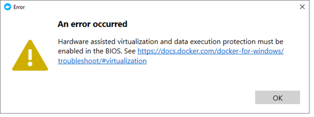
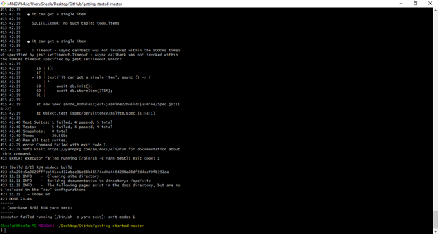
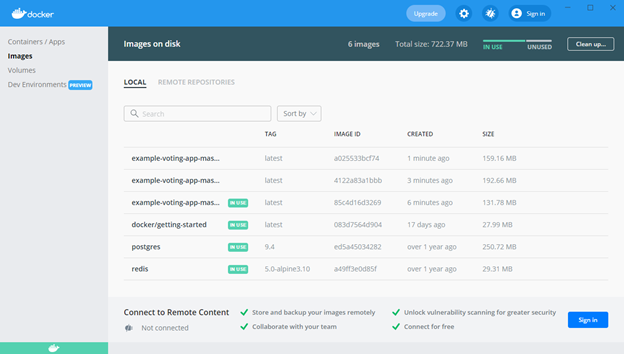

# Docker Desktop for Windows

## Installing Docker Desktop for Windows
These are the steps that I followed to install Docker Desktop:
1.	Download the **Docker Desktop Installer** from the [docker docs](https://docs.docker.com/docker-for-windows/install/) website.
2.	Enable the "Windows Subsystem for Linux" (WSL2) feature using the manual installation steps from https://docs.microsoft.com/en-us/windows/wsl/install-win10.
    
    a.	Open **Windows PowerShell** as administrator and run `dism.exe`.

    b.	Confirm system requirements for running WSL2. For my  x64 system, I verified that the version was 1903 or higher, and build 18362 or higher.

    c. Enable Hyper-V in **Turn Windows features on or off** dialog in **Control Panel**.

    c.	Run `dism.exe` again.

    d.  Restart the system.

    See the **Troubleshooting** section for more details.
3.	Download and run the Linus kernel update package.
4.	Set WSL2 as the default version.
5.	Double-click the *Docker Desktop Installer.exe*. 
### Troubleshooting
Running `dism.exe` a second time did not enable the virtualization feature on my machine. After some research online, I identified the error to be in the Hyper-V settings in Windows Features. The Hyper-V Hypervisor option was grayed out. Enabling this option involved an additional set of steps, as follows:
1. Type `Systeminfo` in the command terminal. 
2. In the Hyper-V requirements, confirm that **Virtualization Enabled in Firmware** is No.
3. Access the BIOS - interrupt startup and press F1 (on my machine).
4. Navigate to **Security** > **Virtualization** > **Intel(R) Virtualization Technology**.
5. Select **Enable**.  
6. Restart the system and enable Hyper-V in Windows Feature.
7. Restart the system again and continue with the Docker installation process.

### Process Improvements
To a non-technical person, the system requirements section is somewhat ambiguous. The information in the troubleshooting link (shown in the image below) was inadequate. I would add some additional information for this step.

**Figure 1. Error Message**

## Using Docker Desktop
The Docker Desktop overview section provided the following introduction. 
>Docker Desktop is an easy-to-install application for your Mac or Windows environment that enables you to build and share containerized applications and microservices.

Two important terms that I tried to understand were
* Containers:  Isolated environments that run applications on a host operating system, using the host’s kernel. Docker allows running multiple containers simultaneously without needing any additional hardware resources.
* Images: A container has an image, which is a file with the data, OS libraries, and other dependencies to run the application. 

The following are a few basic docker commands.

| Command | Description |
----------|---------------
| `docker run` | Runs a command in a new container 
| `docker build` | Builds an image form a Docker file 
| `docker stop` | Stops one or more running containers 
| `docker start` | Starts one or more stopped containers 
| `docker attach` | Attaches to a running container|	
| `docker commit` | Creates a new image from a container’s changes	

## Running a Sample File
1.	Download the Getting Started app from GitHub.

    a. Click the **Code** button and select **Download ZIP**.
2.	Extract the contents to a folder. 
3.	In the app directory, confirm that you can open the project in VS Code.
4. Create a file named `Dockerfile` with no extension in the app folder. 
5. In the command terminal, navigate to the app directory and run the following command:
> `docker build -t getting-started .`

**Figure 2. Build Command Results**

I was unable to replicate the next step in the sample application - start an app container using the `docker run -dp 3000:3000 getting-started` command. 

However, I downloaded another app from https://docs.docker.com/desktop/dashboard/ (Example Voting app) and tested the following command
>   `docker-compose up --build.`

**Figure 3. Example Voting App**

###  Process Improvements
A sample application that can demonstrate the use of multiple commands or an end-to-end application will be useful for beginners.

